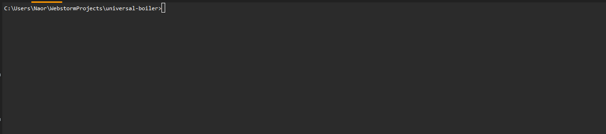

<!-- Introduction -->
## Introduction

Creating the first setup for your project is daunting, much of the time, you'd either search for a     
pre-made boilerplate on github, that is usually never a tailor fit for your needs(and mostly outdated)   
or go about a journey to make it yourself.(for the hundred time)

Universal-Boilerplate has three main goals!
1. Construct a boilerplate that's tailor made for your needs, with all the tooling and jazz.
2. Make it super easy for community contributions to be added.
3. Be un-opinionated, un-restricting as much as possible, unlike awesome projects like next.js, we don't manage stuff for you.   
We merely create the boilerplate and from there on, you're on your own. (for better and worse).


### Prerequisites

You should have Node v12.13 and above, and npx installed on your machine.

## Usage

```
npx universal-boiler
```     

<!-- ROADMAP -->
## Roadmap

-  [ ] Expose more common middlewares for express
-  [ ] Add tooling support (prettier, husky, eslint, dotenv, loggers)
-  [ ] Add testing frameworks (jest, mocha)
-  [ ] Add database connector support
-  [ ] Add support for Hapi
-  [ ] Add support for vue.js
-  [ ] Contributor guide
-  [ ] Better design the flow for recursive question flow
-  [ ] Monorepo support (using yarn workspaces)
-  [ ] More in the future!

<!-- CONTRIBUTING -->
## Contributing

First of all, You're awesome, yea you!
Second, this project was built with the contributors in mind, it should and will be very easy to expand    
and add new packages and options.   
The project will be open to contributions very soon, and a well written contribution guide would be written.


<!-- LICENSE -->
## License

Distributed under the MIT License. See `LICENSE` for more information.


<!-- CONTACT -->
## Contact

Naor Zruk - [@ZrNaor](https://twitter.com/ZrNaor) - naordev@gmail.com


